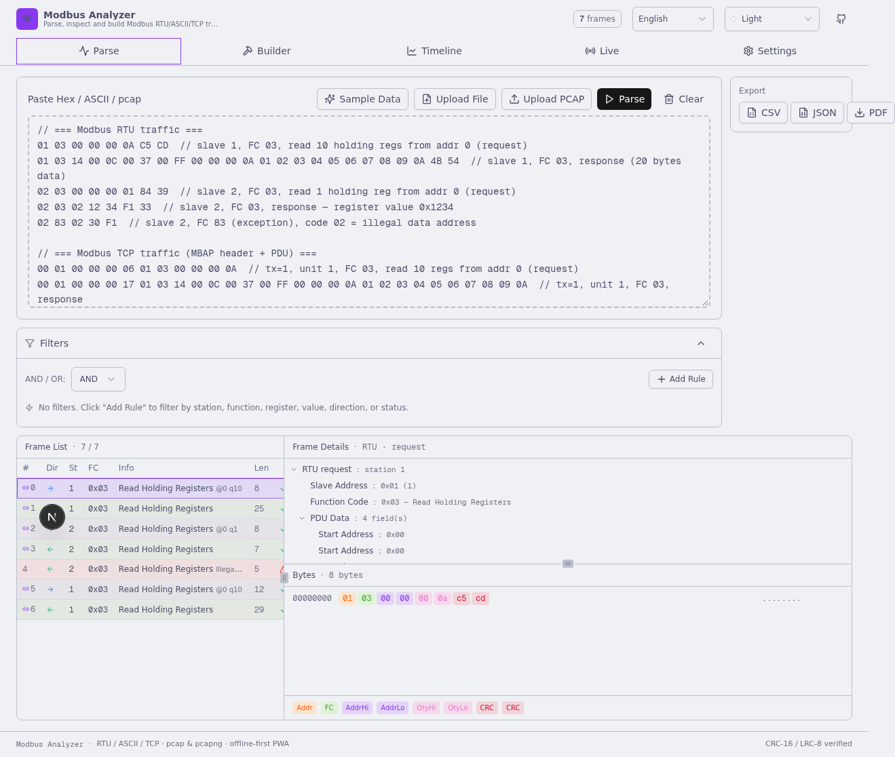
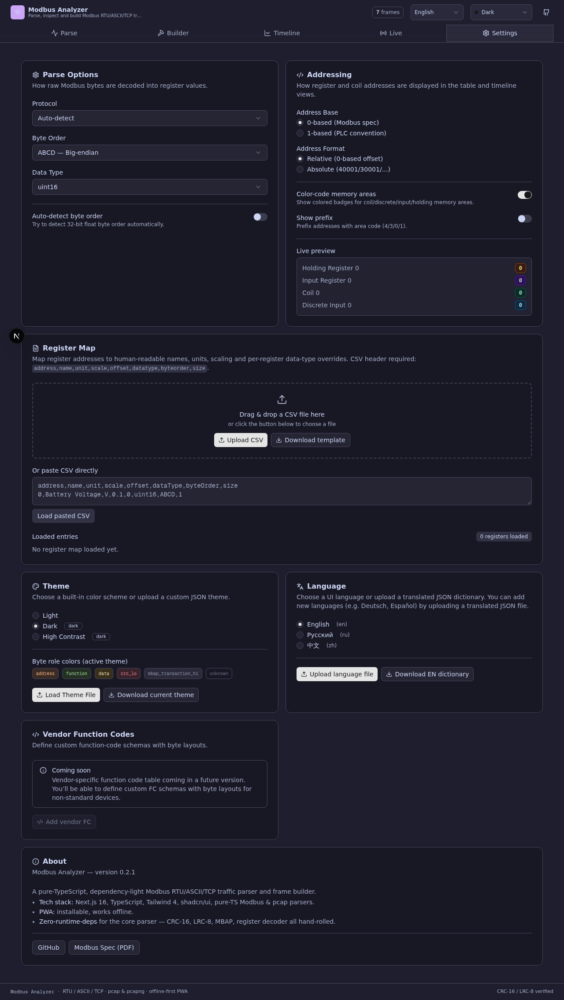
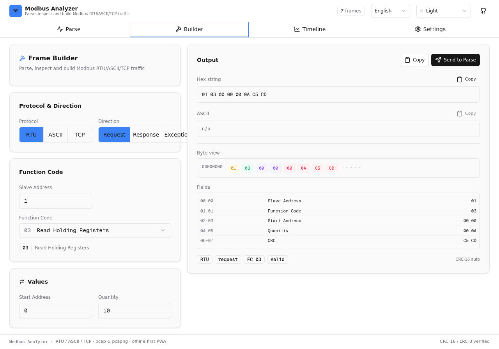
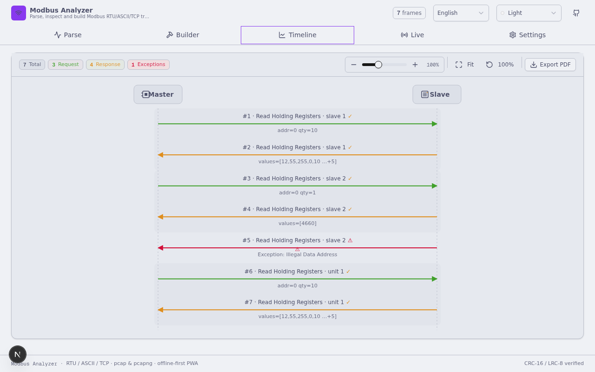
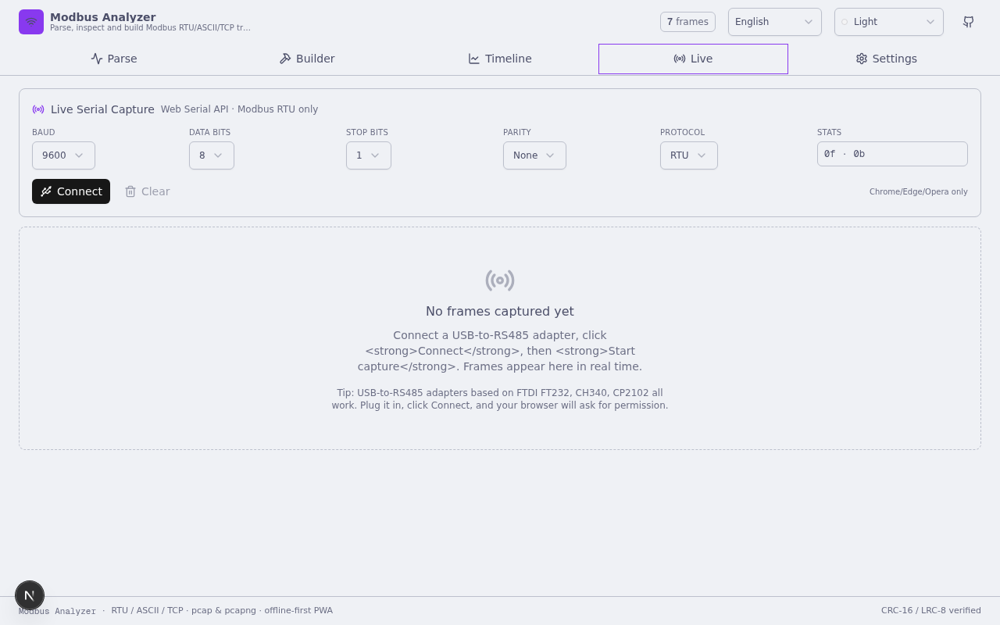
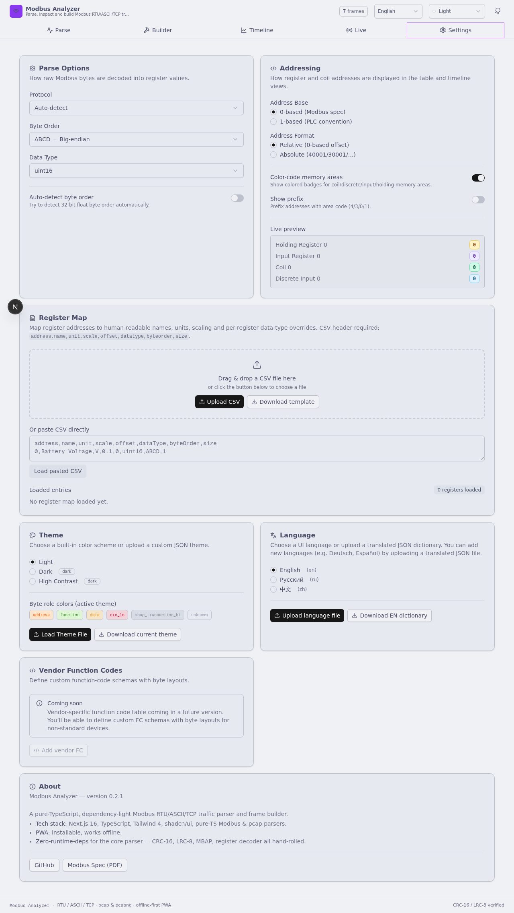

<div align="center">

# 🛰️ Modbus Analyzer

**Advanced PWA for parsing, inspecting & building Modbus RTU/ASCII/TCP traffic**

[](https://tutkis.github.io/Xmodbus-parser/)
[](./LICENSE)
[](https://web.dev/progressive-web-apps/)
[](https://nextjs.org/)
[](https://www.typescriptlang.org/)

### ⚠️ Work in Progress

> **This project is under active development.** Core parsing (RTU/ASCII/TCP, pcap, CRC/LRC validation) is stable and production-ready. Some advanced features (vendor FC tables, live capture, IPv4 fragmentation reassembly) are still being implemented. Bug reports and feature requests are welcome via [Issues](https://github.com/Tutkis/Xmodbus-parser/issues).

</div>

---

> Paste a hex dump, an ASCII frame, or upload a `.pcap`/`.pcapng` capture — get a Wireshark-style breakdown with color-coded bytes, paired request/response, timeline graph, and CSV/JSON/PDF export. **100% client-side. Works offline. Installable on any device.**

🔗 **Live demo:** <https://tutkis.github.io/Xmodbus-parser/>

---

## 📑 Table of contents

- [✨ Features](#-features)
- [📸 Screenshots](#-screenshots)
- [🚀 Live demo](#-live-demo)
- [🛠️ Tech stack](#️-tech-stack)
- [📦 Deploy to GitHub Pages](#-deploy-to-github-pages)
- [🏠 Self-hosting](#-self-hosting)
- [💻 Develop locally](#-develop-locally)
- [🌐 Browser support](#-browser-support)
- [📚 References](#-references)
- [📄 License](#-license)

---

## ✨ Features

### 🔍 Parse tab — Wireshark-style 3-pane view

| Pane | What it does |
|---|---|
| **Packet List** | Every frame with direction arrow (➡️ req / ⬅️ resp), station, function code, status icon (✓ valid / ⚠ exception / ✗ bad CRC). Paired request↔response frames are linked. |
| **Packet Details** | Expandable tree of all protocol fields with values: MBAP header / Slave Address, Function Code + name, PDU data fields, CRC-16/LRC-8 with ✓/✗ validation, Meta. |
| **Packet Bytes** | Hex dump with **color-coded bytes by role** (Address / Function / Data / CRC…). **Delta-detection** highlights bytes that changed vs. the previous frame. Clicking a field in Details highlights its bytes here. |

**Input options:**
- Paste hex dump (`01 03 00 00 00 0A C5 CD`)
- Paste ASCII frame (`:010300000001840A\r\n`)
- Drag & drop a `.txt` / `.hex` / `.log` file
- Upload a `.pcap` or `.pcapng` capture (TCP reassembly + Modbus port auto-detection, not just 502)
- Try sample data button

**Protocol coverage:**
- All standard function codes: 0x01–0x06, 0x07, 0x08, 0x0B, 0x0C, 0x0F, 0x10, 0x11, 0x14–0x18, 0x2B
- All exception codes: 0x01–0x0B (Illegal Function, Illegal Address, Slave Device Failure, etc.)
- Auto-detect protocol (RTU/ASCII/TCP) and direction (request/response/exception)
- Request ↔ Response pairing

### 🔨 Builder tab — frame constructor

- Pick protocol (RTU/ASCII/TCP), direction (Request/Response/Exception)
- All function codes, all field types (start address, quantity, write values, coil bits, response data, sub-function, MEI type)
- Auto-computes **CRC-16** (poly 0xA001), **LRC-8**, and **MBAP length**
- Live color-coded byte preview + copy hex / ASCII
- "Send to Parse tab" to decode what you built

### 📊 Timeline tab — sequence diagram

- Pure-SVG master ↔ slave sequence diagram
- Color-coded arrows: 🟢 request →, 🔵 response ←, 🔴 exception ←
- Paired request+response grouped with subtle background band
- Annotations per FC family (e.g. `@0 q10`, `values=[12, 52, …]`, `Exception: Illegal Address`)
- Register-map names substitute raw addresses when available
- Zoom controls (slider + ± + Fit + 100%)
- Click any arrow → jump to that frame in the Parse tab
- Native multi-line tooltips with full hex + parsed fields

### 🎛️ Filters — Wireshark-style

- Multiple rules with **AND / OR** combinator
- Filter by: `station`, `function code`, `register address`, `value`, `direction`, `status`
- Operators: `equals`, `contains`, `>`, `<`, `regex`
- Per-rule enable toggle

### 💾 Export

- **CSV** — full frame data (index, protocol, direction, FC, address, quantity, CRC validity, hex, ascii, …) — opens in Excel / Google Sheets
- **JSON** — structured frames with all parsed fields, suitable for programmatic processing
- **PDF** — printable A4 report with color-coded frame table, multi-page

### ⚙️ Settings

| Section | Options |
|---|---|
| **Parse options** | Protocol (Auto/RTU/ASCII/TCP), Byte order (ABCD/DCBA/BADC/CDAB + auto-detect), Data type (uint16/int16/uint32/int32/float32/float64/bits/ascii) |
| **Addressing** | 0-based (Modbus spec) vs 1-based (PLC convention), Relative vs Absolute (40001/30001/…), Color-code memory areas, Show prefix |
| **Register map** | Upload CSV (`address,name,unit,scale,offset,dataType,byteOrder,size`) → parsed values show `Temperature = 30.0 °C` instead of `register 0x0001 = 0x012C` |
| **Theme** | 3 built-in (Light / Dark / High Contrast) + upload custom JSON theme |
| **Language** | English / Русский / 中文 + upload custom dictionary JSON to add new languages |
| **Vendor FCs** | Placeholder for future vendor-specific function code table |

### 🎨 Byte color scheme

| Field | Color (Light) | Meaning |
|---|---|---|
| Slave Address / Unit ID | 🟠 amber | "who's talking" |
| Function Code | 🟢 emerald | "what's happening" |
| Start Address | 🟣 violet | address pointer |
| Quantity / Byte Count | 🌸 rose | dimension |
| Data / Register Values | 🔵 teal | payload |
| CRC / LRC | 🔴 red | checksum (visible for verification) |
| MBAP Header (TCP) | ⚪ zinc | transport wrapper |
| Exception Code | 🟥 dark red | error signal |

### 📡 Live capture (Serial + TCP)

Two live capture modes, both fully client-side:

**Serial (Web Serial API)** — for Modbus RTU/ASCII over USB-to-RS485:
- **Chrome / Edge / Opera** (v78+) — Web Serial API
- Configurable: baud rate (1200–115200), data bits (7/8), stop bits (1/2), parity (none/even/odd)
- USB-to-RS485 adapters based on FTDI FT232, CH340, CP2102 all work
- Browser asks for permission when you click Connect — no drivers needed

**TCP (WebSocket Bridge)** — for Modbus TCP over the network:
- Browser can't make raw TCP connections, so a tiny **Rust binary** (~700KB) proxies WebSocket → TCP
- Download `modbus-bridge` from [GitHub Releases](https://github.com/Tutkis/Xmodbus-parser/releases) (Windows / macOS / Linux / ARM)
- Run it: `./modbus-bridge` (listens on port 3030, no install, no runtime deps)
- PWA auto-detects the bridge — status badge turns green when it's running
- **"Scan network" button** — bridge parallel-scans your local /24 for devices with port 502 open, shows found devices as click-to-connect chips
- Enter device host + port (or click a scan result), click Connect
- Also supports RTU-over-TCP (some devices wrap RTU frames inside TCP)
- No data stored by the bridge — pure passthrough
- **Android**: run via Termux (`pkg install rust && cargo install modbus-tcp-bridge`)
- **iOS**: run bridge on a PC/Raspberry Pi on same WiFi, connect to its IP

Both modes:
- Real-time parsing — frames appear as they arrive (250ms flush interval)
- Frames flow into the shared Parse-tab UI (list + details + bytes) and Timeline
- Export captured frames to CSV/JSON/PDF

> ⚠️ Firefox and Safari do not support Web Serial API. The Serial tab shows a friendly notice with a "Switch to TCP mode" button on those browsers.

### 📱 PWA

- **Installable** on desktop & mobile (Chrome/Edge/Safari "Install" / "Add to Home Screen")
- **Offline** — service worker caches the app shell + static assets
- **Responsive** — mobile-first, works from 360px phone to 4K monitor
- **Zero backend** — pure static export, host anywhere

---

## 📸 Screenshots

### Parse tab — Wireshark-style 3-pane view (Catppuccin Latte theme)


### Parse tab — dark theme (Catppuccin Mocha)


### Builder tab — frame constructor with live colored preview


### Timeline tab — SVG sequence diagram (master ↔ slave)


### Live tab — Web Serial API real-time capture


### Settings tab — parse options, addressing, register map, themes, languages


---

## 🚀 Live demo

**👉 <https://tutkis.github.io/Xmodbus-parser/>**

Auto-deployed from `main` via GitHub Actions. Every push triggers a rebuild.

---

## 🛠️ Tech stack

| Layer | Technology |
|---|---|
| Framework | Next.js 16 (App Router, static export) |
| Language | TypeScript 5 (strict) |
| Styling | Tailwind CSS 4 + shadcn/ui (New York) |
| State | Zustand (with persist middleware) |
| Theming | Custom reactive theme registry → CSS variables |
| i18n | Custom lightweight runtime (no i18next dependency) |
| Modbus parser | Pure TS (~3300 LOC) — CRC-16, LRC-8, all FCs, byte orders |
| pcap parser | Pure TS (~1800 LOC) — libpcap + pcapng, TCP reassembly |
| PDF export | jsPDF + html2canvas (lazy-loaded) |
| PWA | manifest.webmanifest + custom service worker |
| Deploy | GitHub Actions → GitHub Pages |

**No backend. No database. No external runtime dependencies for parsing.**

---

## 📦 Deploy to GitHub Pages

This repo includes a ready-to-use GitHub Action (`.github/workflows/deploy.yml`).

### One-time setup

1. **Fork or clone** this repo to your GitHub account.
2. Go to **Settings → Pages → Build and deployment → Source → GitHub Actions**.
3. Push to `main`. The workflow will:
   - Install Bun + dependencies
   - Auto-derive `basePath` from your repo name (handles both `user.github.io/repo` and `user.github.io` root sites)
   - Run `next build` (produces `out/` via `output: "export"`)
   - Add `.nojekyll` (so GitHub Pages doesn't break `_next/` paths)
   - Upload as a Pages artifact and deploy
4. Wait ~2 min — your app is live at `https://<your-username>.github.io/<repo-name>/`

### Manual trigger

GitHub Actions tab → "Deploy to GitHub Pages" → Run workflow.

---

## 🏠 Self-hosting

The build output is fully static — host the `out/` directory on any static file server:

```bash
bun install
bun run build
# Serve ./out/ with any static server:
npx serve out -l 3000
# Or: caddy file-server --root out --listen :3000
# Or: python3 -m http.server -d out 3000
# Or: nginx, Apache, S3+CloudFront, Cloudflare Pages, Netlify, Vercel…
```

### Subpath deploy

If hosting under a subpath (e.g. `example.com/modbus/`), set the env var before building:

```bash
NEXT_PUBLIC_BASE_PATH=/modbus bun run build
```

### Root domain deploy

For root domain (e.g. `modbus.example.com`), no `basePath` is needed — the config defaults to empty.

---

## 💻 Develop locally

```bash
# Install dependencies
bun install

# Start dev server (http://localhost:3000)
bun run dev

# Lint
bun run lint

# Production build (outputs to ./out/)
bun run build
```

### Project structure

```
src/
├── app/                    # Next.js App Router
│   ├── layout.tsx          # Root layout with PWA metadata
│   └── page.tsx            # Main page (4 tabs)
├── components/
│   ├── ui/                 # shadcn/ui components
│   ├── tabs/               # ParseTab, BuilderTab, TimelineTab, SettingsTab
│   ├── parse/              # InputPanel, PacketList, PacketDetails, PacketBytes, FilterBar, ExportButtons
│   └── timeline/           # SVG sequence diagram components
├── hooks/                  # useI18n, useTheme (useSyncExternalStore wrappers)
└── lib/
    ├── modbus/             # Pure-TS Modbus parser (CRC, LRC, FCs, builder, register decoder)
    ├── pcap/               # Pure-TS pcap/pcapng parser + TCP reassembly
    ├── i18n/               # i18n runtime + EN/RU/ZH dictionaries
    ├── themes/             # Theme registry + 3 presets
    ├── colorize/           # Byte tokenizer (role → color)
    └── store/              # Zustand app store
public/
├── manifest.webmanifest    # PWA manifest
├── sw.js                   # Service worker (offline cache)
├── icon.svg                # App icon (any)
├── icon-maskable.svg       # App icon (maskable for Android)
└── .nojekyll               # Disable Jekyll on GitHub Pages
.github/workflows/
└── deploy.yml              # GitHub Pages auto-deploy
```

---

## 🌐 Browser support

| Browser | PWA install | Service worker | Notes |
|---|---|---|---|
| Chrome / Edge / Opera 90+ | ✅ | ✅ | Full support |
| Firefox 110+ | ✅ (via menu) | ✅ | Full support |
| Safari 16+ | ✅ ("Add to Home Screen") | ✅ | Full support |
| Safari 15 | ❌ | ✅ | SW works, no install prompt |

---

## 🗺️ Roadmap

See [TODO.md](./TODO.md) for the full roadmap. Highlights:

- **Modbus Master mode** — send requests from the browser (not just capture)
- **Real-time register graphs** — SCADA-style monitoring of values over time
- **Session export to pcap** — save captured traffic back to .pcap for Wireshark
- **Modbus gateway/router** — bridge RTU ↔ TCP (legacy device integration)
- **IWA edition** — Direct Sockets API for Chrome power users (no bridge needed)
- **Web Bluetooth** — for Modbus RTU over BLE
- **Vendor function code table** — user-defined FC schemas

## 📚 References

- [Modbus Application Protocol Specification v1.1b3](https://www.modbus.org/file/secure/modbusprotocolspecification.pdf) — official spec
- [pcap file format](https://wiki.wireshark.org/Development/LibpcapFileFormat) — libpcap docs
- [pcapng file format](https://pcapng.com/) — next-gen capture format
- [Modbus over Serial Line](https://www.modbus.org/file/secure/Modbus_over_Serial_Line_V1_02.pdf) — RTU/ASCII spec
- [Modbus Messaging on TCP/IP](https://www.modbus.org/file/secure/Modbus_Messaging_Implementation_Guide_V1_0b.pdf) — TCP/MBAP spec

---

## 📄 License

[MIT](./LICENSE) © Tutkis

---

<div align="center">

**Built with ❤️ for the industrial automation community**

If this tool saved your debugging session, ⭐ the repo to help others find it.

</div>
